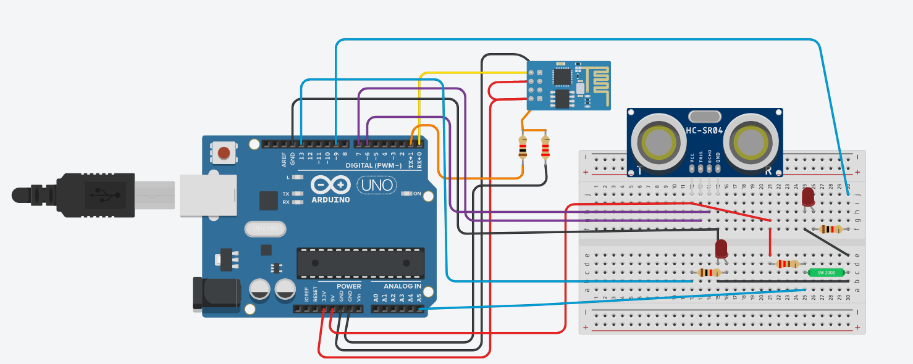
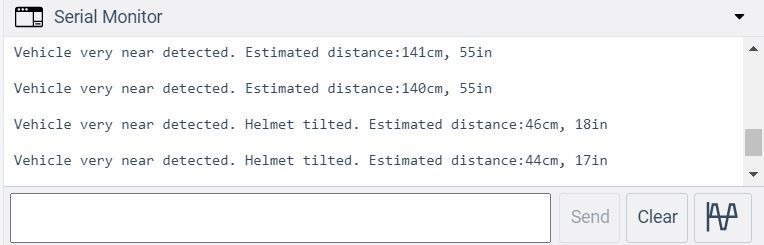

# Smart-Helmet
In this project of Innovative Helmet, the circuit is connected as shown in the circuit diagram with Ultrasonic sensor, Tilt sensor, Arduino, Wi-Fi Module (ESP8266), LED, Resistors and Connecting wires. After setting up the connections and code the program is uploaded to board and simulated. When ever the Ultrasonic sensor detects the distance of the vehicle less than or equal predefined threshold distance and the tilted becomes 0, it indicates that the accident has happened. So, when this condition is triggered it sends an SMS to a particular mobile number using IFTTT. 

**Circuit diagram:**

**Serial Monitor output:**

